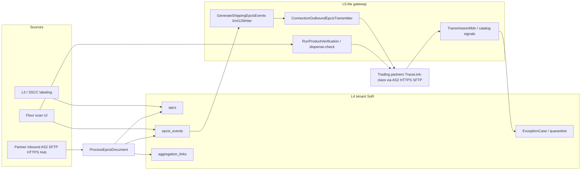

# L4/L5 DSCSA capability audit (read-only)

**Date:** 2026-08-28  
**Scope:** TracePharma codebase at `/dpool/tracepharma`  
**Method:** Architecture map first, then rubric scoring with file evidence. Absent if no evidence — not Partial by guess.  
**Constraint:** Audit and recommend only; no application code changes in this deliverable.

---

## 1. Architecture snapshot

**What TracePharma is today:** A **multi-tenant Laravel 13 / Filament 5 L4-oriented DSCSA platform** (pharmacy, wholesaler, 3PL, manufacturer, buying-group control-plane) whose system of record is an **EPC + EPCIS event projection store** (`epcs`, `epcis_events`, `aggregation_links`, `epc_ilmd`) with floor workstations (receive/pack/ship/commission/decommission) and an **L5-lite partner gateway** (HTTPS / SFTP / AS2 outbound, inbound webhooks + SFTP poll + hub presets). It is **not** a national L5 regulatory hub, **not** a TraceLink/SAP ATTP proprietary network client (those are connection presets), and **not** a pure L3 site tool.

**Stack (from repo):** PHP ^8.4, Laravel ^13.8, Filament ^5, Sanctum, Horizon, Stancl tenancy, Spatie activitylog/permission/data, MySQL (MariaDB driver available), Redis+Horizon intended (`.env.example`), Flysystem S3/SFTP.

**Key modules:**

| Area | Paths |
|------|--------|
| Serial / event store | `app/Models/Epcis/Epc.php`, `EpcisEvent.php`, `AggregationLink.php`, `EpcIlmd.php` |
| Ingest | `app/Actions/Epcis/ProcessEpcisDocument.php`, `ValidateEpcis12Document.php`, `ReceiveEpcisUpload.php` |
| Ship / TI-TS | `app/Actions/Shipping/GenerateShippingEpcisEvents.php`, `ValidateOutboundShippingSend.php` |
| Transmit | `app/Services/Epcis/ConnectionOutboundEpcisTransmitter.php`, outbound HTTPS/SFTP/AS2 senders |
| Trace | `app/Services/Tracing/BuildAssetTrace.php`, `app/Filament/App/Pages/AssetTracking.php` |
| Exceptions | `app/Services/Exceptions/ExceptionService.php`, `app/Support/Exceptions/ExceptionCorrectionProfile.php` |
| VRS | `app/Actions/Vrs/RunProductVerification.php`, `app/Models/Verification.php` |

**Relevant schema:** `database/migrations/tenant/2026_07_31_130001_create_epcis_schema_tables.php` (`epcs`, `epcis_events`, `aggregation_links`), plus compliance hardening and SSCC labeling migrations under `database/migrations/tenant/`.

---

## 2. Scorecard table

Scoring scale: **0 Absent · 1 Stub · 2 Partial · 3 Functional · 4 Strong · 5 Complete**

| ID | Capability | Score | Evidence (paths) | Gap in one sentence |
|----|------------|------:|------------------|---------------------|
| L4.1 | Corporate serial repository | 3 | `epcs` + `uk_gtin_serial` / `epc_uri` unique (`2026_07_31_130001_create_epcis_schema_tables.php`); status via events + `TerminalEpcDisposition` / `ShippableEpcsAtSite`; inbound upsert in `ProcessEpcisDocument` | No EPC status column or point-in-time “status at UTC” API; lifecycle is inferred from latest events. |
| L4.2 | Master data SoR | 3 | `Product`, `Site`, `TradingPartner`; `Domain/Gs1/CheckDigit` / `ProductForm`; `EpcIlmd`; connection EPCIS version on outbound | No effective-dated Product/Partner history; partner SLA/immutability profiles are thin vs rubric. |
| L4.3 | Event orchestration L3→L4 | 3 | Commission/agg/decomm actions + ingest; file SHA duplicate `ReceiveEpcisUpload`; catalog validation DLQ via exceptions; ship from scanned session | `L2_L3_RECONCILIATION_FAILURE` is stub-only; no L4=ASN=scan quantity gate on outbound; event_id uniqueness is per document/generation not global. |
| L4.4 | Aggregation integrity | 3 | `aggregation_links` open/close; `BuildAssetTrace`; `AssertOutermostSsccHasChildren` (exists only); domain `AggregationHierarchyService::detectDriftAfterDecommission` | Drift detector not wired into `EmitDecommissioningEpcis`; no child-count vs last aggregation ship block; no first-class split/partial pallet. |
| L4.5 | Decommissioning | 2 | `EmitDecommissioningEpcis` / `GenerateDispositionObjectEvent` → bizStep decommissioning + disposition `inactive` only; `DecommissionWorkstation` | No reason picker / CBV disposition choice; no dual-control SoD for mass decommission; no printed-not-shipped auto-decommission. |
| L4.6 | Exception workbench | 4 | `ExceptionResource`, `ExceptionCorrectionProfile`, quarantine + partner apply-form; corrections fix MD / reprocess | Rich workbench, but several catalog codes are hook/stub-only (`QUANTITY_MISMATCH`, `L2_L3_RECONCILIATION_FAILURE`); reprocess **deletes** superseded event generations. |
| L4.7 | Trace reconstruction | 4 | `AssetTracking` + `BuildAssetTrace`; compliance TI/PDF exports under `app/Services/Dscsa/` | Strong operator path; not a formal interoperable partner “trace response” API product. |
| L4.8 | Audit / access / retention | 3 | Spatie logs on docs/MD/cases; roles + regulatory password gate; `EpcisRetentionReportCommand` (report, no deletes); `retention_years` in config | Events lack activitylog; prune/delete removes history; VRS job can log scan payload (`RunProductVerificationJob`). |
| L4.9 | L4 reporting | 3 | `DashboardWidgetCatalog`, Compliance Alert Center, Partner Ingest Quality, compliance report types | Missing first-class L3→L4 lag, decommission-reason breakdown, and stuck-serial SLA pack without assembly. |
| L5.1 | Outbound TI/TS EPCIS | 4 | `GenerateShippingEpcisEvents` 1.2 XML; GLN/bizTxn/TI-TS fragments; CBV allowlist; JSON-LD writer for some paths | Ship path lacks pinned XSD/`ValidateEpcis12Document` **before** transmit; ship always 1.2 XML (no dual-stack ship authoring). |
| L5.2 | Transport and acks | 4 | `OutboundTransport` https/sftp/as2; real senders; `TransmitEpcisJob` retry; MDN + `PARTNER_REJECTED_FILE` / `MISSING_MDN` / `LATE_MDN` | TraceLink/ATTP are presets only; quiet-failure detection is MDN-SLA based, not full hub app-ack. |
| L5.3 | Inbound EPCIS | 4 | Authenticated webhooks/SFTP/hub; `ValidateEpcis12Document`; upsert into L4; `SERIAL_SHIPPED_NOT_COMMISSIONED` catalog rule | AS2 inbound not operator-selectable on form; ASN match is receiving-session oriented, not full expected-ASN enterprise object. |
| L5.4 | Verification VRS | 2 | `Verification`, `RunProductVerification`, `POST /api/v1/dispense-check`, Http/Fake/Null clients | Production default `VRS_DRIVER=null` (deferred); not a complete GS1 LMS production stack with dock circuit-breaker productization. |
| L5.5 | Partner lifecycle | 2 | `TradingPartner`, inbound/outbound connections (encrypted creds), `IntegrationHealth`, scenario evidence CLI | No partner onboarding FSM (test→conformance→first live lot→hypercare) or cert-expiry lifecycle product. |
| L5.6 | Regulatory / partner tracing | 3 | Asset Trace + DSCSA compliance PDF / TI history; exception/suspect paths exist in compliance surfaces | No packaged interoperable trace-response exchange as primary path; still UI/export-centric. |
| L5.7 | L5 reporting | 3 | Integration Health metrics; MDN catalog signals; VRS dashboard widgets; Partner Ingest Quality | Transmit/MDN/VRS fail buckets exist partially; not a complete partner health grid + late-file reason pack. |
| Contract | L4↔L5 contract block | 3 | Transmitters send documents; NACK → exception (`RecordOperationalEpcisCatalogSignal`); VRS stores query/response on `verifications`; file-level ingest dedupe | Replay is not a global enterprise-event-id no-op; inbound L5 channel correctly writes L4 via Process (OK); ship bypasses full schema gate. |

### Subtotals

- **L4:** 3+3+3+3+2+4+4+3+3 = **28 / 45** (62%)
- **L5:** 4+4+4+2+2+3+3 = **22 / 35** (63%)
- **Contract block:** **3 / 5**
- **Weighted overall (60% L4 / 40% L5):** **≈ 62%**
- **Verdict:** Credible mid-market **L4 SoR + L5-lite gateway** on happy path; not yet a complete enterprise L4 immutability/quantity/aggregation gate or production VRS/network certification stack.

---

## 3. Critical / High findings

1. **High — Historical event prune deletes generations** — FDA/partner RCA may lose prior event rows after `ReprocessEpcisDocument` + `PruneSupersededIngestGenerations`. Breaks append-only SoR expectation.
2. **High — Ship without schema hard-gate before transmit** — `ValidateOutboundShippingSend` is ops/ATP/hierarchy-empty checks; authored XML can transmit without `ValidateEpcis12Document`. Risk: unvalidated EPCIS to partners.
3. **High — Aggregation count integrity on ship is weak** — `AssertOutermostSsccHasChildren` only requires open children `exists()`, not count = last valid aggregation. Risk: incomplete/wrong hierarchy TI.
4. **High — No L4↔ASN↔scan quantity gate / split object** — outbound `expected_count => 0` (`OpenOutboundShippingSession`); split/partial pallet not first-class. Risk: qty mismatch / undeclared partials.
5. **High — VRS deferred by default** — `config/vrs.php` / Null driver; dock verify-before-accept not production-ready without explicit HTTP config.
6. **Medium — Decommission is single CBV path** — only `inactive` + decommissioning; no reason/SoD. Weak QA/destruction/theft audit trail.
7. **Medium — Serial-bearing scan logged** — `RunProductVerificationJob` logs `scan`. Privacy/audit channel risk.
8. **Medium — L3/L4 qty reconcile stub** — `L2_L3_RECONCILIATION_FAILURE` has no caller; manufacturer CMO overprint drift undetected.
9. **Medium — Predictable sequential SSCC mode exists** — `SsccAllocationMode::Sequential` (mitigated by uniqueness/`assertUnused`, but sequential is weaker against prediction if ranges leak).

---

## 4. Gap list grouped

### Must fix before any live partner traffic

- Pre-transmit schema/catalog validation on authored ship (and disposition) documents
- MDN reject / late / missing already emit exceptions — keep enabled; do not disable quiet-fail signals
- Confirm outbound connection credentials encryption and no secrets in logs
- Aggregation empty-SSCC gate is not enough — add child-count / open-parent completeness for live lots

### Must fix before calling this an L4 system of record

- Append-only event retention (archive superseded generations; stop hard-delete of historical events)
- Point-in-time custody (status-as-of UTC) from event timeline
- Quantity gate + first-class split shipment / partial pallet
- Wire aggregation drift detection into decommission/ship
- Decommission reasons + dual control for mass ops
- L3↔L4 reconciliation with real emitters (not stubs)

### Should fix before monthly leadership / FDA-style trace use

- Decommission reason reporting; stuck-serial SLA; L3→L4 lag metrics
- Partner onboarding/conformance state machine + golden-event packs (beyond CLI evidence)
- Production VRS HTTP + circuit breaker + no full serials in app logs
- Retention purge/archive policy beyond report-only

### Later (nice-to-have, not compliance-blocking)

- Dual-stack ship JSON-LD 2.0 authoring
- Native TraceLink/ATTP SDKs (presets + AS2/SFTP may suffice)
- AS2 selectable on inbound connection form
- Full GS1 Query Control scheduler
- Effective-dated master data tables

---

## 5. Recommendations (prioritized)

1. **Ship pre-transmit hard-gate** — Why: bad EPCIS to partners. Smallest change: run catalog/XSD validator on persisted outbound payload in `ScheduleOutboundEpcisTransmission` / transmitter before send; fail → exception, no transmit. Boundary: L4 validate → L5 transport only. Tests: valid ship OK; bad URI/CBV reject; replay no double-send.
2. **Keep superseded events** — Why: immutability. Soft-retire generations (`superseded_at`) instead of prune-delete; Asset Trace already prefers last-good. Tests: reprocess keeps old rows; audit can load prior generation.
3. **SSCC ship completeness gate** — Why: custody tree. Compare open child count to establishing AggregationEvent qty / last ADD set in `ValidateOutboundShippingSend`. Tests: missing child blocks; matching count passes.
4. **Quantity / split objects** — Why: ASN↔scan↔L4. Add `expected_count` from ASN/order and optional split declaration before complete. Tests: mismatch blocks; declared split allows.
5. **Wire drift detector** — Call `AggregationHierarchyService::detectDriftAfterDecommission` from decommission path; open exception on drift. Tests: decommission child under open parent → exception.
6. **Decommission reasons** — Map UI reason → CBV disposition; require second approver role for N>threshold. Tests: single-unit path; mass SoD deny/allow.
7. **VRS production path** — Document required `VRS_DRIVER=http`; redact scan in logs; store verification against status snapshot. Tests: latency timeout; null driver explicit fail; payload stored.
8. **L3 reconcile job** — Emit `L2_L3_RECONCILIATION_FAILURE` when commissioned labels ≠ L4 commission events for a batch. Tests: match silent; mismatch cases.

Do **not** rewrite into separate L4/L5 microservices; the monolith boundary (event store vs transmitters) already supports this if validation stays out of adapters.

---

## 6. Suggested build order (8–12)

1. Pre-transmit EPCIS schema/catalog gate on outbound ship docs
2. Stop deleting superseded `epcis_events` (archive/soft-supersede)
3. Ship SSCC open-child count vs last aggregation
4. Wire aggregation drift → exception on decommission
5. Outbound quantity expected vs confirmed + declared split
6. Decommission reason → CBV disposition (+ mass SoD)
7. Redact serials from non-audit logs; VRS HTTP readiness checklist enforcement
8. Activate L3/L4 reconcile emitter for SSCC batches
9. Point-in-time custody query (GTIN+serial as-of)
10. Partner conformance checklist state on `OutboundConnection` / TradingPartner
11. Leadership pack metrics: stuck serials, decommission reasons, transmit/MDN %
12. Dual-stack ship 2.0 only after 1–5 are green

---

## 7. Assumptions and questions

- Assumed tenant DB is the enterprise SoR (no external L4 beside it).
- Assumed production may still run `VRS_DRIVER=null` — confirm per environment.
- Unknown which partners are live AS2 vs SFTP vs hub, and whether TraceLink is envelope-only.
- Unknown whether CMOs commission into this tenant or only forward via L3 endpoint.
- Unknown whether event prune in production has already removed RCA-needed history.
- Product intent: replace TraceLink/ATTP vs sit beside them? Repo supports “beside via AS2/SFTP,” not replace.
- EPCIS 1.3 rubric item: codebase centers **1.2 XML ship** + **2.0 JSON-LD** opt-in — treat 1.3 as not a first-class product path unless confirmed elsewhere.

---

## Security / integrity extras (flags)

| Issue | Severity | Notes |
|-------|----------|--------|
| Serial reuse | Mitigated | DB uniques on `epc_uri`, `(gtin14, serial_number)`, `sscc18`; SSCC allocator `assertUnused` |
| Unauthorized commission/decommission | Gated | Filament `NavShip` + `supportsCommissioning()`; no public commission REST API |
| Unauthenticated inbound EPCIS | Mitigated | Connection auth / webhooks / signed hub paths (confirm per env) |
| Master-data tampering without audit | Partial | Spatie `LogsActivity` on Product/Site/TradingPartner |
| Historical event delete/update | **Critical gap** | Prune deletes superseded generations; Eloquent allows event mutation |
| Secrets in source/logs | Mitigated for creds | Connections use `encrypted:array`; watch VRS scan logging |
| Full serials in app logs | **Flag** | `RunProductVerificationJob` logs `scan` |
