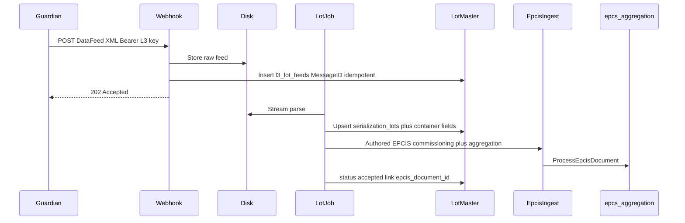

# Guardian L3 lot-close ingest (manufacturer)

**Status:** Implemented — bugfix applied; pending deploy.  
**Cursor plan:** `Guardian L3 Lot Ingest-365df164.plan.md`  
**Decided:** 2026-08-27  
**Sample feed:** `/tmp/235-20260827084354691.xml` (Guardian proprietary `DataFeed`, ~25MB)

## Locked product decisions

- **Delivery:** HTTPS POST from Guardian (or bridge)
- **Tenancy:** Single manufacturer tenant MVP (tenant from host/tenancy); multi-tenant routing later
- **Accept policy:** Archive raw + **auto-accept** (project with no operator gate)
- **Architecture:** Dual-layer — lot master/metadata for UniTrace-like UX **and** EPCIS projection into existing `epcs` / `aggregation_links` (no parallel event store)

## Expert decision

**Dual-layer ingest** — not EPCIS-only, not a parallel event store.

| Layer | Why |
|--------|-----|
| **Lot master + raw feed** | UniTrace-style lot page needs Material/NDC, times, and the full `LotControlData` key/value bag; Asset Fields need `GS1_XML` / `RawSeq` / `URI`. Those proprietary bags do not survive cleanly in `epc_ilmd.extra_json`. |
| **EPCIS projection into existing ingest** | Skills (`dscsa-laravel-serialization`, `implement-pharma-serialisation`) forbid a second EPC repository. Commissioning + Pallet→Case→Bottle must land in `epcs` / `aggregation_links` via `ReceiveEpcisUpload` → `ProcessEpcisDocument`. |

Industry context: Guardian/UniSeries is L1–L3 line; UniTrace is L4 repository + EPCIS. TracePharma acts as L4 for this manufacturer path (inbound from Guardian), complementary to existing outbound `ForwardCommissioningToL3`.

## UX targets (UniTrace parity)

- **Lots list / ViewLot:** Material identifier (NDC), material name, lot TZ offset, start/end, expire, plus LotControl highlights
- **Lot Control Data tab:** Full `LotControlData` key/value map (`N/A` for empty)
- **Asset Tracking → Fields tab:** Per-container `GS1_XML`, `RawSeq`, `URI`, etc.; lot number deep-links to ViewLot

## Data architecture (tenant DB)

1. **`l3_lot_feeds`** — one row per POST: `message_id` (unique), `file_sha256`, disk path, `status` (`received` → `processing` → `accepted` / `failed`), `error_summary`, timestamps. Immutable raw bytes on the EPCIS payload disk under e.g. `l3/guardian/{uuid}.xml`.

2. **`serialization_lots`** — lot master for list/detail UX:
   - Identity: `lot_number` (unique per tenant with product key), `ndc`, `unit_gtin14`, `case_gtin14`, `product_name`, `expire_date`, `mfg_date`, site/line (`site_id` from `SiteId`, `line_name`)
   - Times: `lot_processed_at`, `timezone_offset`, `lot_info_saved_at` (from `__SptLotInfo.LotInfoSaved__` when present)
   - **`lot_control_data` JSON** — full `LotControlData/Data[@Name]` map (and safe extras from Envelope/Header)
   - Counts: pallets/cases/units; `feed_id`, `epcis_document_id` (nullable until projection finishes)
   - Status: `accepted` after successful auto-project

3. **`serialization_lot_container_fields`** — Fields tab / asset enrichment (scale-aware):
   - `lot_id`, `epc_uri` (unique with lot), `container_type` (`Pallet`/`Case`/`Bottle`), `parent_epc_uri` nullable
   - **`fields` JSON** — `ContainerId[@Name]` → value
   - Index `(lot_id)`, `(epc_uri)`; never select `fields` on list pages

Do **not** invent a second event timeline. Hierarchy for ops remains `aggregation_links`.

## Inbound HTTP (MVP)

- Route: `POST /api/v1/l3/guardian/lot-close` (tenant API; tenant from domain)
- Auth: `Authorization: Bearer {l3.api_key}`; require `l3.enabled` + provider `systech`
- Body: raw XML; max size ~30–50MB
- Idempotency: duplicate `Envelope/MessageID` or identical `sha256` → existing feed, no second project
- Response: **202** after bytes stored + feed row; never parse 25MB inline
- Org Settings toggle: “Accept Guardian lot-close inbound” (manufacturer profile)

## Backend execution flow

1. **ReceiveGuardianLotFeed** — auth + store + dispatch + 202
2. **ConvertAndAcceptGuardianLotJob** — XMLReader stream → lot/fields upsert → author EPCIS 1.2 commissioning + aggregation → `ReceiveEpcisUpload` / `ProcessEpcisDocumentJob` → mark `accepted`
3. Hard gates: lot + GTIN + expiry; parseable URI or GS1_XML per container; hierarchy vs CaseQty; Domain GS1 check digits

## Filament

- **Serialization Lots** resource (`TenantProfile::Manufacturer`): table, ViewLot overview, Lot Control Data tab, optional Hierarchy tab, link to EPCIS document
- **Asset Tracking:** Fields tab when container fields exist; lot deep link
- Debounced search (≥500ms)

## Exception and audit

- 401 / 413 / 422 on receive; convert failure → feed `failed` + retry; MessageID idempotent; do not mark `accepted` until projection validates; retain raw for reprocess / 6-year posture

## Implementation sequence

1. Migrations: `l3_lot_feeds`, `serialization_lots`, `serialization_lot_container_fields`
2. Settings + API route + `ReceiveGuardianLotFeed` + tests (auth, idempotency, 202)
3. Streaming parser + lot/fields persistence (trimmed fixture)
4. DataFeed → EPCIS authoring + auto ingest; scale check vs full sample
5. Filament Lots resource
6. Asset Tracking Fields tab
7. `docs/integrations/` note; deploy only when asked (source-first)

## Out of scope (this slice)

- Multi-tenant hub routing by SiteId
- SFTP drop folder
- Serial number provisioning pools (NRM) back to Guardian
- Full UniTrace rework/exception OT loop
- Changing pharmacy inbound EPCIS hub behavior

## Todos (when scheduled)

- [x] `l3-schema` — tenant migrations
- [x] `l3-webhook` — HTTPS receive + Bearer + idempotency + 202
- [x] `l3-parser-project` — stream parse → lot/fields → EPCIS → ProcessEpcisDocument
- [x] `l3-lots-ui` — Filament Serialization Lots ViewLot (`SerializationLotResource`, table, overview + Lot Control Data + Hierarchy tabs)
- [x] `l3-asset-fields` — Asset Tracking Fields tab + lot link (`AssetTracking::containerField()`/`containerFieldLotUrl()`, `AssetTrackingInfolist` Fields tab)
- [x] `l3-tests-docs` — fixtures/tests + integrations doc (`GuardianLotCloseIngestTest`, `SerializationLotsResourceTest`, `AssetTrackingPageTest` Fields tab tests, `docs/integrations/guardian-lot-close.md`, `docs/knowledge-base/en/operations/serialization-lots.md`)
