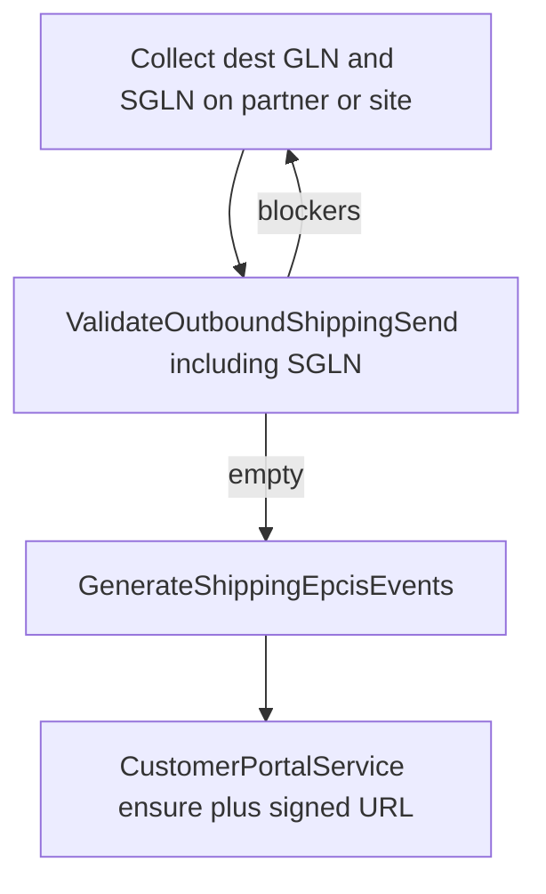

# Collect dest GLN/SGLN + portal on send — Design Spec

> Path locked from `2026-08-23` research brief: **collect-only**. Do not assign a customer GLN from the tenant prefix. Do not use the small-dispenser exemption to skip dest SGLN.

**Goal:** A distributor (or pharmacy desk) can send TI to an independent dispenser who has no AS2 by (1) recording the dispenser’s **stated** GLN and SGLN, then (2) auto-issuing the existing customer portal link after a successful author. That matches Cencora/LSPedia: identity first, portal second.

**Non-goals:** Invent a 6/6 SGLN. Assign a GLN from our GS1 prefix (`assigned_by_us`). DEA/NCPDP as `bizLocation`. Email TI. Exemption / human-readable pack without dest SGLN. Rebuild frozen pages (Ship Order HUD, Trading Partners form, Outbound EPCIS table).

---

## Locked decisions

| Topic | Decision |
|---|---|
| Identity | Collect the customer’s GLN **and** a stand-behind SGLN. Same resolution as today (`SglnResolution` — recorded URN or org-prefix match only). |
| Access | After authoring succeeds, `CustomerPortalService::ensureCustomerPortalLink` + signed URL in the send notification. Portal still does not author TI. |
| Assign-from-prefix | Deferred. Requires a later legal/product decision. |
| Exemption handoff | Deferred. Clock ends 27 Nov 2027; not a GS1 dest identity. |
| Frozen UI | Ship Order view/HUD: observe-only. Trading Partners: existing GLN/SGLN fields stay; no form rebuild. Pharmacy Outbound Desk may gain a dest picker (not frozen). |

---

## Why send still fails today

`ValidateOutboundShippingSend` requires a ship-to **GLN** (session, site, or partner). `GenerateShippingEpcisEvents::resolveShipTo` then requires an SGLN for that GLN. A partner with a GLN and a blank SGLN can pass validation and fail in the author; the session reverts.

`PharmacyOutboundDesk` has no ship-to site / GLN picker, so dest identity is only whatever is already on the customer row.

The customer portal lists authored shipping docs. It cannot fill an empty dest.

---

## Product behavior

### 1. Pre-send: dest SGLN is a blocker

`ValidateOutboundShippingSend` must refuse with a human-readable blocker when dest GLN is present but `SglnResolution` returns null for that GLN (same candidate list as `GenerateShippingEpcisEvents::shipToSglnCandidates`: site `sgln`, partner `sgln`, inbound published URNs for that GLN).

Copy (stable for tests):

> Record the customer’s SGLN on the trading partner or ship-to site for GLN {gln}. A partner’s GS1 company prefix is theirs to state, not ours to guess.

Do not invent a URN in the validator. If dest GLN is missing, keep the existing “Provide a ship-to GLN or partner site” blocker.

This is the only Ship Order change: action/query, not Blade.

### 2. Collect: where the operator types the GLN/SGLN

Use master data that already exists:

- Trading partner `gln` / `sgln` (current form — no rebuild).
- Partner site `gln` / `sgln`.
- Session `ship_to_gln` / `ship_to_site_id` (already on the session).

**Pharmacy Outbound Desk** (new, required for the no-GLN dispenser story):

- Customer picker stays.
- Dest control: select an active site of that customer. If the customer has no sites, the desk creates one (`name` = partner name, `is_active` = true) and selects it. If the customer has many sites, the operator must pick one — paste never writes to a random site.
- Optional paste: GLN + SGLN persist onto the **selected site** (and set session `ship_to_site_id` / `ship_to_gln`). Partner-level `gln`/`sgln` are not overwritten by paste.
- Pasted SGLN must encode the pasted GLN (`Sgln` / `SglnRules`). Reject mismatch. Never derive the URN from the 13 digits.
- “Send TI” stays `CompleteOutboundShippingSession`. Disabled while `ValidateOutboundShippingSend` returns blockers (already true via `sendIsMissingRequiredRefs`).

### 3. After author: issue portal pickup

In `CompleteOutboundShippingSession`, **after** `GenerateShippingEpcisEvents` succeeds:

1. Load the session customer (`trading_partner_id`).
2. If the partner is active, call `CustomerPortalService::ensureCustomerPortalLink`.
3. Callers (Pharmacy desk, existing Ship Order send action) show a success notification whose body is the signed portal URL (`signedCustomerPortalUrl`). Copyable. TTL remains `tracepharma.customer_portal.link_ttl_days` (default 30).
4. Portal issue must **not** fail the send. If the partner is inactive or URL generation throws, log and still return the completed session.

No new outbound transport. No email of the link in this slice. Operator copies the URL (same as `CustomerPortalLinks`).

No-connection AS2/HTTPS skip stays benign.

### 4. What the dispenser sees

Unchanged portal: signed index + download of outbound shipping docs for that partner. They still need a GLN/SGLN **in the file**; the link is access only.

---

## Architecture

| Unit | Responsibility |
|---|---|
| `ValidateOutboundShippingSend` | Dest GLN **and** resolvable dest SGLN before complete |
| `SglnResolution` | Unchanged — no new encode path |
| `PharmacyOutboundDesk` | Dest picker / paste that writes partner or site |
| `CompleteOutboundShippingSession` | After author, ensure portal uuid (non-fatal) |
| Filament send actions | Notification with signed URL |
| `CustomerPortalService` | Unchanged contract |

---

## Data

No new tables. No `assigned_by_us`. Optional later: activity log already records `customer_portal_link_issued` when the uuid is first set.

---

## Tests (Pest, Demo2 isolation)

| ID | Case |
|---|---|
| **CG-1** | `ValidateOutboundShippingSend`: partner GLN set, no SGLN and no inbound published URN → blocker contains “not ours to guess” / GLN digits. Session stays open. |
| **CG-2** | Same partner after site/partner `sgln` recorded (valid URN for that GLN) → no dest-SGLN blocker. |
| **CG-3** | Inbound published SGLN for that GLN still satisfies the validator (existing `send_uses_inbound_event_party_sgln` stays green). |
| **CG-4** | Pharmacy desk: paste dest GLN+SGLN, Send TI authors a document; partner `customer_portal_uuid` is set. |
| **CG-5** | Complete with inactive customer: send still succeeds; no portal URL required. |
| **CG-6** | Signed portal index lists the new shipping document. |

Do not add a test that encodes SGLN from 13-digit GLN.

---

## Success criteria

- Send cannot enable when dest SGLN cannot be resolved.
- Authoring still never invents a prefix split.
- Successful send issues (or reuses) `customer_portal_uuid` and shows a signed URL.
- Frozen Ship Order / Trading Partners layouts are unchanged.
- Assign-from-prefix and exemption paths are not implemented.

---

## Follow-ons (out of this spec)

- Tenant-prefix GLN assignment (WDD group-license model).
- Email the signed portal URL.
- Small-dispenser exemption pack without dest SGLN.
