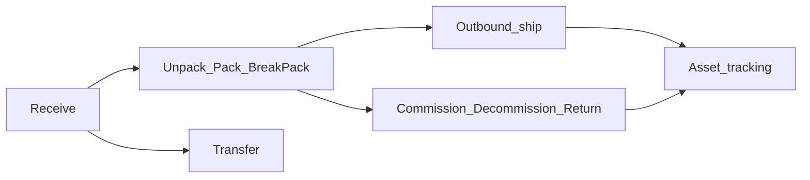

# Operator workflow knowledge base

Screenshot-backed guides for TracePharma **App panel** operations on the demo tenant (`demo2`). Each page covers purpose, steps, UI captures, and the **CBV biz_step / disposition** authored when the workflow completes.

## In-app (Filament)

After `composer require guava/filament-knowledge-base`, the same articles are served in the tenant **Help** panel (`/help`) via Guava. Linked desks expose a top-bar help control. Sync workflows **and** clustered articles from `docs/kb-source/`:

```bash
php scripts/sync-knowledge-base-docs.php
```

See [docs/knowledge-base/README.md](../knowledge-base/README.md) for Guava group layout. Admin-only notes live under `docs/admin-knowledge-base/` (separate panel on the admin host).

## How to use

1. Read [CBV biz steps & dispositions](cbv-biz-steps.md) for the authoring oracle.
2. Open a workflow page below and follow the steps against your tenant (demo credentials in the repo README).
3. See [Findings](findings.md) for bugs and improvements noticed while capturing these docs.

**Capture environment:** `https://demo2.internal.vatengi.com` · Drug Wholesaler demo · site chooser required for floor desks.

## End-to-end flow



## Workflow index

| Workflow | Doc | UI slug | Authored biz_step |
|---|---|---|---|
| Shell & site | [shell-and-site.md](shell-and-site.md) | `/login`, Operations Hub | — |
| Receiving | [receiving.md](receiving.md) | `receiving-sessions`, `scan-in` | `receiving` |
| Unpack | [unpack.md](unpack.md) | `unpack-workstation` | `unpacking` |
| Pack | [pack.md](pack.md) | `pack-workstation` | `packing` |
| Break & pack | [break-pack.md](break-pack.md) | `break-pack-workstation` | unpack then pack |
| Transferring | [transferring.md](transferring.md) | `transferring-sessions` | `shipping` + `receiving` |
| Outbound shipping | [outbound-shipping.md](outbound-shipping.md) | `outbound-shipping-sessions`, `scan-out` | `shipping` |
| Pharmacy outbound | [pharmacy-outbound.md](pharmacy-outbound.md) | `pharmacy-outbound` | `shipping` (profile-gated) |
| Commission | [commission.md](commission.md) | `commission-all-workstation` | `commissioning` |
| Decommission | [decommission.md](decommission.md) | `decommission-workstation` | `decommissioning` |
| Return | [return.md](return.md) | `return-workstation` | `returning` |
| Saleable return | [saleable-return.md](saleable-return.md) | `saleable-return` | `returning` |
| Repack transform | [repack-transform.md](repack-transform.md) | `repack-transform` | TransformationEvent / `commissioning` |
| Verify product (VRS) | [verify-product.md](verify-product.md) | `verify-product` | — (verification only) |
| Asset tracking | [asset-tracking.md](asset-tracking.md) | `asset-tracking` | timeline of prior steps |
| Receiving issues | [receiving-issues.md](receiving-issues.md) | `receiving-issues` | exceptions |

## Page template

Every workflow doc follows:

1. Metadata (slug, Filament class, who, produces)
2. When to use / prerequisites
3. Steps with screenshots under `media/{slug}/`
4. Authored EPCIS checklist
5. Related pages / quirks
