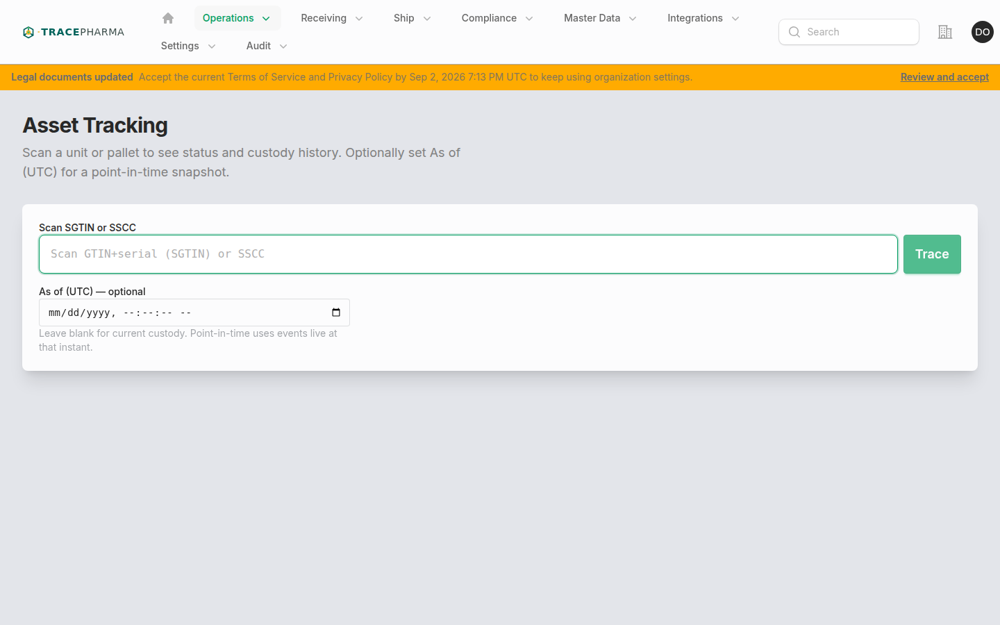
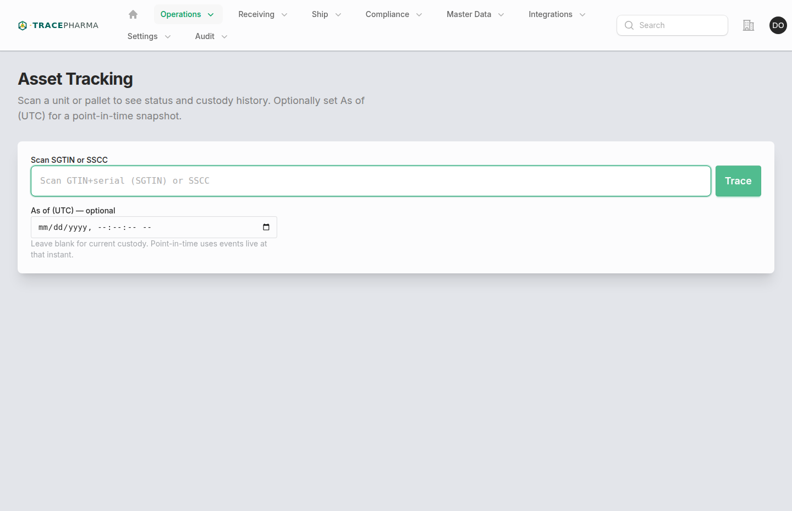

# Asset tracking

- **Slug / URL:** `/asset-tracking`
- **Filament:** `App\Filament\App\Pages\AssetTracking`
- **Who:** inbound integrations **or** any operations feature; one of `NavIntegrations`, `NavReceive`, `NavShip`, `NavExceptions`, `NavVerify`
- **Produces:** — (read-only timeline of prior authored/inbound events)

## When to use

Trace an SGTIN or SSCC: current disposition, custody site, event timeline, and optional point-in-time snapshot. Subheading: *Scan a unit or pallet to see status and custody history. Optionally set As of (UTC) for a point-in-time snapshot.*

## Prerequisites

- User authorized for EPC’s last-seen site (or all-sites access).
- Scan resolves via `ResolveEpcFromScan` / `BuildAssetTrace`.
- Optional `?scan=` and `?as_of=` query params for deep links.
- Units still packed under an open SSCC inherit that container’s last-seen location after a transfer or partner receive that names the SSCC only.

## Steps (with screenshots)

1. Open **Asset tracking** from Operations nav or hub trace route.

2. Scan barcode or enter identifier; optionally set **As of (UTC)** for historical custody.
3. Review **Tracking** tab: status, disposition, last location, timeline of events.
4. Use context links to open related EPCIS documents, receive sessions, or verify desk.

## Authored EPCIS checklist

Not applicable — Asset tracking **displays** events authored elsewhere.

When reviewing timeline entries, expect CBV values as either:

- Full URN: `urn:epcglobal:cbv:bizstep:receiving`
- Local name: `receiving`

Storage and display paths may use either form depending on writer; compare semantically, not string-exact.

## Related pages

- [receiving.md](receiving.md), [outbound-shipping.md](outbound-shipping.md), [commission.md](commission.md) — event sources
- [cbv-biz-steps.md](cbv-biz-steps.md) — biz_step / disposition oracle
- [shell-and-site.md](shell-and-site.md) — hub scan routes here for unknown context

## Notes / known quirks

- **CBV local name vs URN** — timeline may show `commissioning` or full URN; both mean the same biz step.
- Site-scoped authorization: “Not authorized” if user lacks access to last-seen site.
- Map widget loads from `tp-asset-tracking-map.js` when location data exists.
