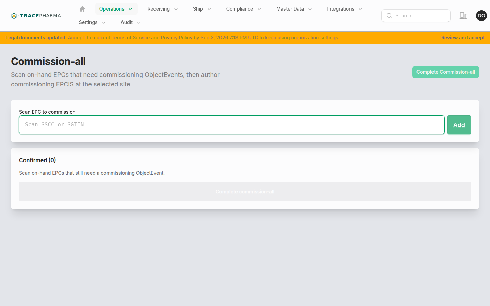
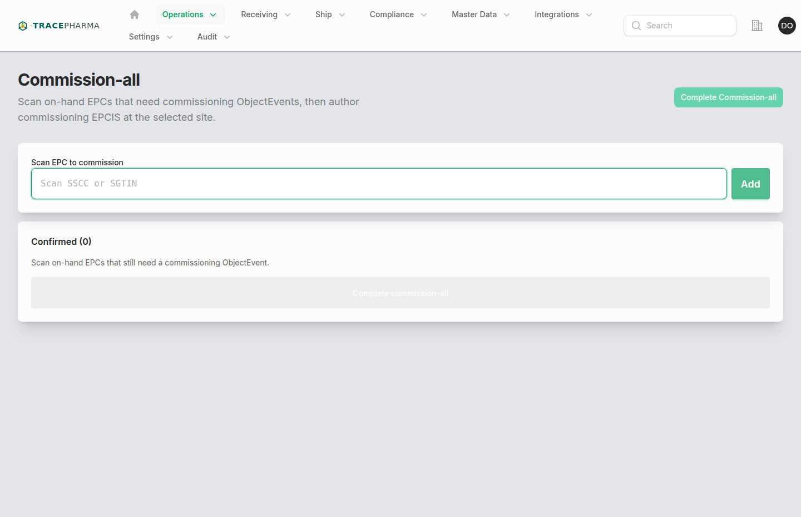

# Commission-all

- **Slug / URL:** `/commission-all-workstation`
- **Filament:** `App\Filament\App\Pages\CommissionAllWorkstation`
- **Who:** `supportsCommissioning()` and `NavShip`
- **Produces:** `commissioning` + `active` (ObjectEvent)

## When to use

Author commissioning ObjectEvents for on-hand EPCs that lack a commissioning event — e.g. after label issue, repack edge cases, or manual catch-up. Subheading: *Scan on-hand EPCs that need commissioning ObjectEvents, then author commissioning EPCIS at the selected site.*

## Prerequisites

- Site selected in site chooser.
- EPC on hand at site; no existing commissioning event (`EpcHasCommissioningEvent` gate).
- Not blocked by open receive hold or ship session.

## Steps (with screenshots)

1. Open **Commission-all** from Operations nav.

2. Scan SSCC or SGTIN barcodes; confirmed list accumulates.
3. **Complete commission** — `EmitCommissioningEpcisForEpcs` → `GenerateDispositionObjectEvent`.

## Authored EPCIS checklist

- [ ] ObjectEvent per commissioned EPC
- [ ] `bizStep`: `urn:epcglobal:cbv:bizstep:commissioning`
- [ ] `disposition`: `urn:epcglobal:cbv:disp:active`
- [ ] `readPoint` at selected site GLN
- [ ] Document `authored_kind` commissioning

## Related pages

- [pack.md](pack.md) — may auto-commission parent SSCC
- [repack-transform.md](repack-transform.md) — TransformationEvent with commissioning biz step (Prepackager)
- [decommission.md](decommission.md) — inverse lifecycle action

## Notes / known quirks

- Skips EPCs that already have commissioning history.
- Regulatory compliance affirmations may wrap the complete action.
