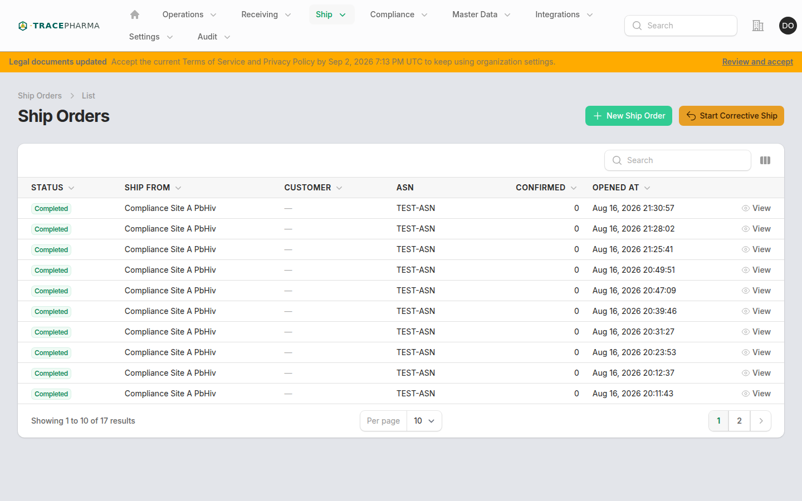
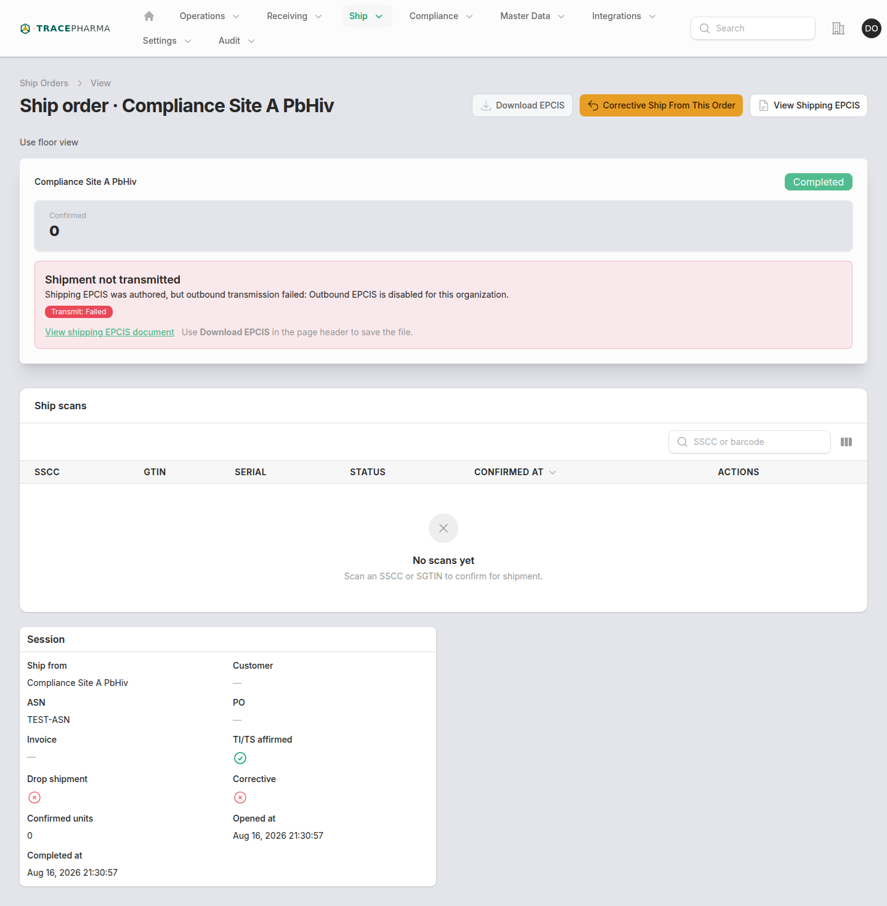
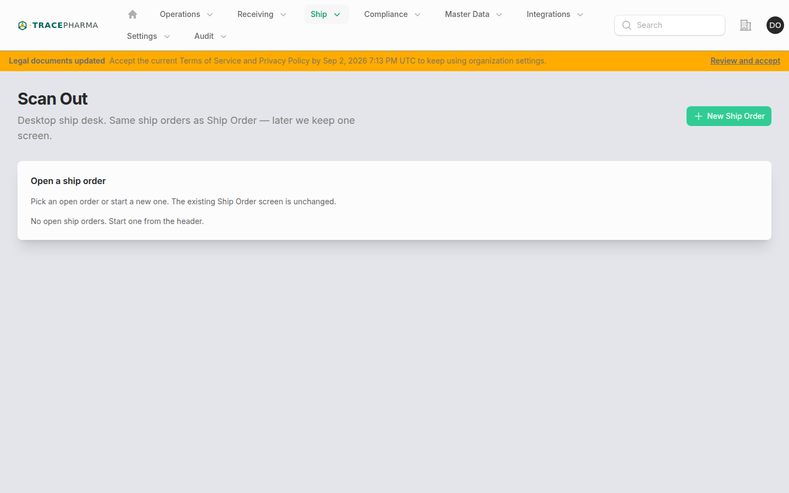
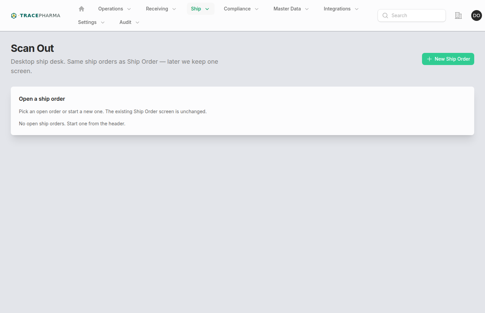
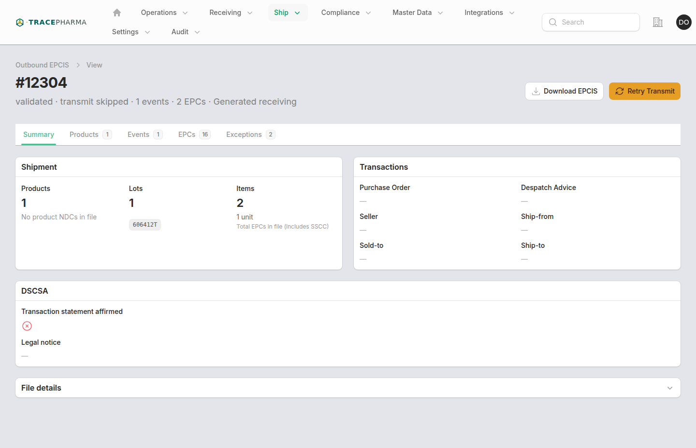
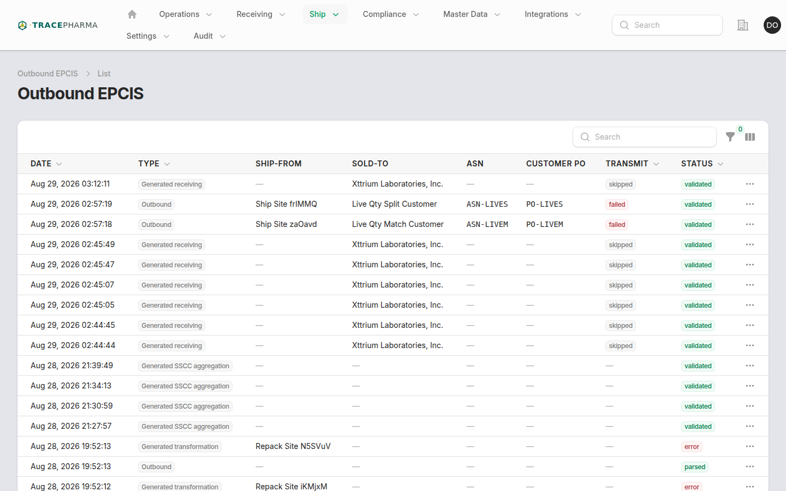
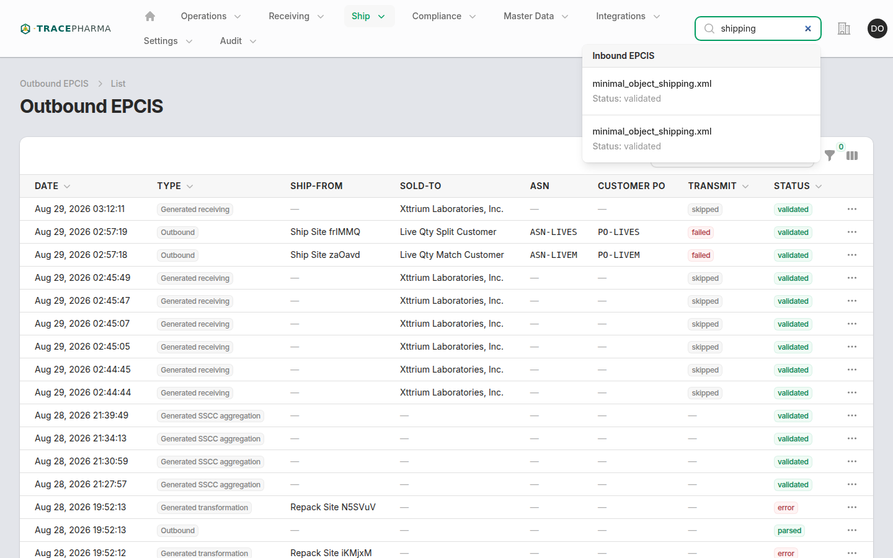

# Outbound shipping

- **Slug / URL:** `/outbound-shipping-sessions`, `/scan-out`, `/outbound-shipping-sessions/{id}`
- **Filament:** `App\Filament\App\Resources\OutboundShippingSessions\OutboundShippingSessionResource`; desk: `App\Filament\App\Pages\ScanOutWorkstation`
- **Who:** `supportsOutboundIntegrations()` and `NavShip` (Drug Wholesaler, Manufacturer, Prepackager, 3PL, etc.)
- **Produces:** `shipping` + `in_transit` (ObjectEvent on scan-out complete)

## When to use

Ship orders to trading partners with DSCSA TI/TS outbound EPCIS. **Scan Out** is the canonical desktop ship desk (scan → customer → send wizard). **Ship Order** is the session list and audit/detail view.

## Prerequisites

- Site selected; ship-from site matches on-hand custody.
- Trading partner and destination identity (GLN/SGLN) recorded on session.
- Readiness badges green (partner connection, affirmations, outermost SSCC children when applicable).

## Steps (with screenshots)

1. Open **Ship Order** or **Scan Out** from Ship nav.

2. Create or select open session; set partner, ship-to, ASN/PO references, DSCSA affirm when required.

3. Scan and confirm each SSCC/SGTIN.

4. **Complete ship** — `GenerateShippingEpcisEvents`; session status closed.
5. Confirm authored shipping events from the session or under **Ship → Outbound EPCIS**.

## Authored EPCIS checklist

- [ ] ObjectEvent per shipped EPC
- [ ] `bizStep`: `urn:epcglobal:cbv:bizstep:shipping`
- [ ] `disposition`: `urn:epcglobal:cbv:disp:in_transit`
- [ ] DSCSA TI/TS document fields when affirm enabled
- [ ] Outbound EPCIS document queued/transmitted per connection

## Related pages

- [pharmacy-outbound.md](pharmacy-outbound.md) — pharmacy profile alternative (not available on wholesaler demo)
- [pack.md](pack.md) — ensure SSCC hierarchy before ship
- [asset-tracking.md](asset-tracking.md) — post-ship trace
- [cbv-biz-steps.md](cbv-biz-steps.md)

## Notes / known quirks

- **Demo capture:** no open ship orders were available during mid-flow screenshots; **session 1101** (completed) was used for session detail and EPCIS views. That session shows **0 confirmed scans** but EPCIS was authored — useful for corrective/demo sessions, though the copy can read as contradictory (see [findings.md](findings.md)).
- **Demo env:** session 1101 **transmit failed** because outbound EPCIS is disabled for the organization (`Outbound EPCIS is disabled for this organization` — org kill-switch / outbound disabled).
- Scan Out subheading: desktop ship desk wizard (scan, customer, send on one screen).
- Under-scan vs expected units: use **Declare split / partial** rather than lowering `expected_count` after scanning.
- Live / hypercare / first-live-lot connections require `expected_count > 0` before send.
- `OutboundShipReadiness` badges surface blockers before complete.
- Recall flags block confirm on affected serials.
