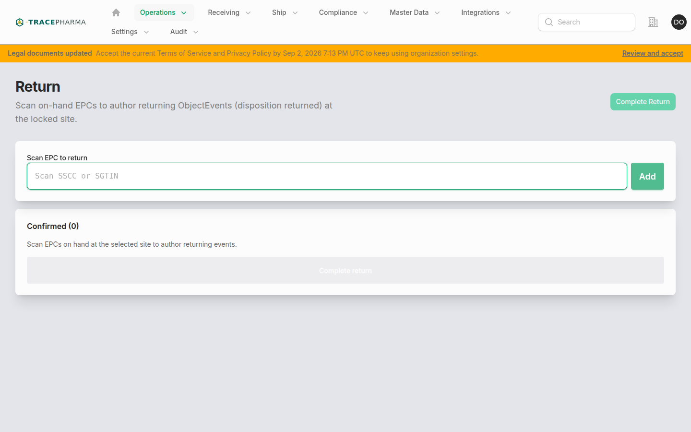
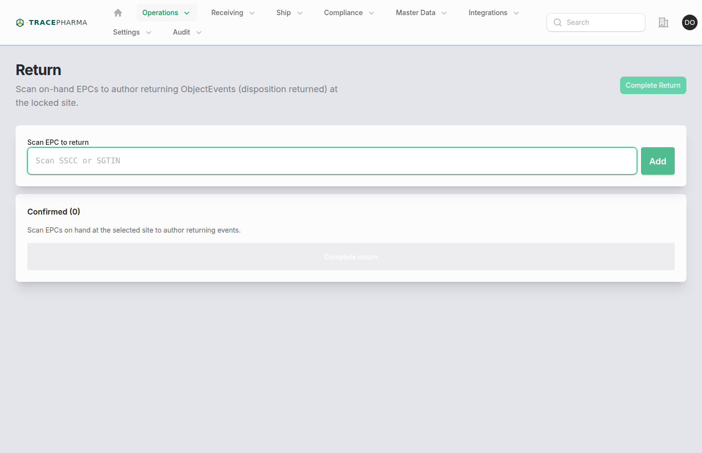

# Return

- **Slug / URL:** `/return-workstation`
- **Filament:** `App\Filament\App\Pages\ReturnWorkstation`
- **Who:** `supportsReturning()` and `NavShip`
- **Produces:** `returning` + `returned` (ObjectEvent)

## When to use

Author returning events for on-hand EPCs being sent back to a supplier or removed from salable stock without VRS credit workflow. Subheading: *Scan on-hand EPCs to author returning ObjectEvents (disposition returned) at the locked site.*

## Prerequisites

- Site selected; first scan locks session to that site.
- EPC on hand; operable for returning (not terminal disposition).
- Not quarantined on open receive hold.

## Steps (with screenshots)

1. Open **Return** from Operations nav.

2. Scan SSCC/SGTIN; site locks on first confirmed scan.
3. Accumulate confirmed list; **Complete return** → `EmitReturningEpcis`.

## Authored EPCIS checklist

- [ ] ObjectEvent per returned EPC
- [ ] `bizStep`: `urn:epcglobal:cbv:bizstep:returning`
- [ ] `disposition`: `urn:epcglobal:cbv:disp:returned`
- [ ] Site GLN on event
- [ ] Document `authored_kind` returning

## Related pages

- [saleable-return.md](saleable-return.md) — VRS-gated saleable credit path
- [decommission.md](decommission.md) — destroy/expired with decommissioning biz step
- [receiving.md](receiving.md) — partner return may later appear as inbound receive

## Notes / known quirks

- No VRS check on this desk — use Saleable return when verification is required before credit.
- Site lock prevents mixing returns across sites in one batch.
