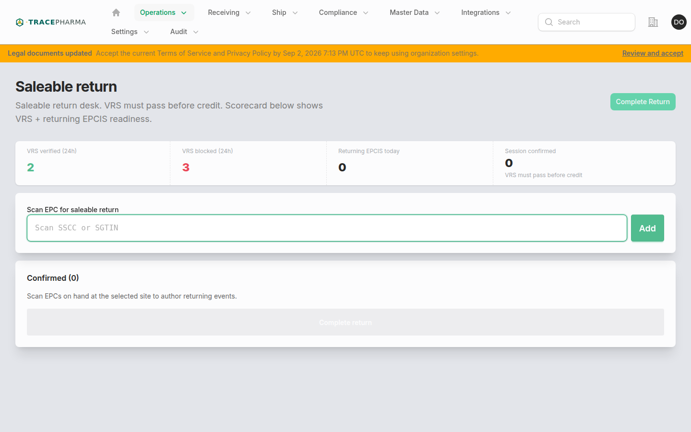
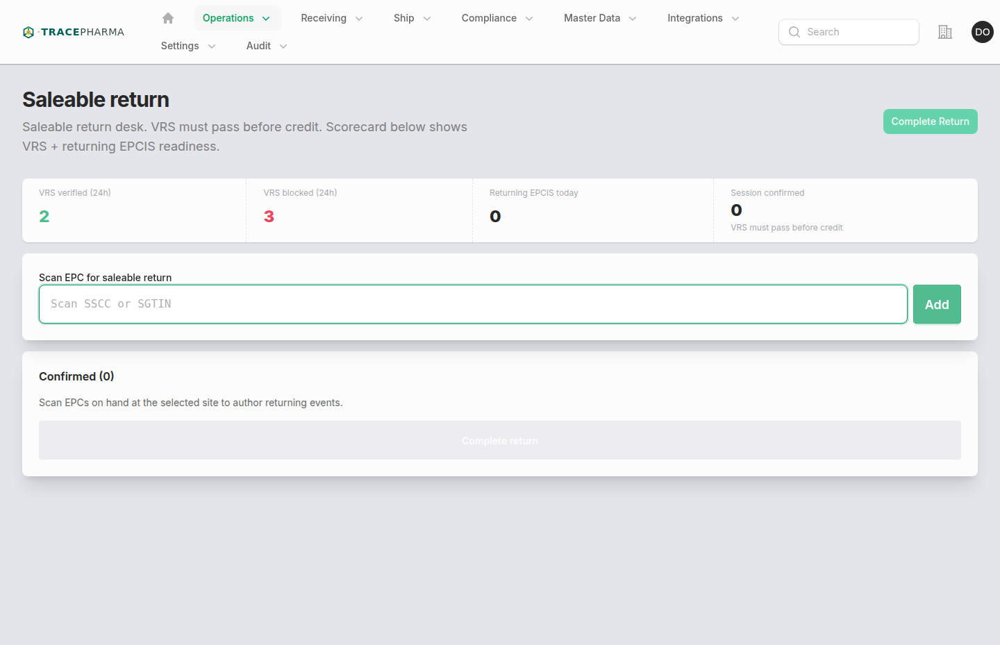

# Saleable return

- **Slug / URL:** `/saleable-return`
- **Filament:** `App\Filament\App\Pages\SaleableReturnWorkstation`
- **Who:** `supportsReturning()` and `NavShip`
- **Produces:** `returning` + `returned` (ObjectEvent, after VRS pass)

## When to use

Process returns that must **pass VRS** before saleable credit and returning EPCIS. Subheading: *Saleable return desk. VRS must pass before credit. Scorecard below shows VRS + returning EPCIS readiness.*

## Prerequisites

- Site selected; first scan locks site (same as Return desk).
- VRS configured and reachable for tenant.
- Scan must yield `verified` status from `RunProductVerification`.
- EPC on hand; not recalled or quarantined.

## Steps (with screenshots)

1. Open **Saleable return** from Operations nav.

2. Review scorecard: VRS verified/blocked/deferred counts and returning authored today.
3. Scan unit — VRS runs on each scan; only verified units join confirmed list.
4. **Complete saleable return** → `EmitReturningEpcis`.

## Authored EPCIS checklist

- [ ] VRS verification record with `verified` status per unit
- [ ] ObjectEvent: `returning` / `returned`
- [ ] Same returning document shape as [return.md](return.md)
- [ ] Scorecard metrics updated (`SaleableReturnScorecardMetrics`)

## Related pages

- [return.md](return.md) — non-VRS return path
- [verify-product.md](verify-product.md) — dispense-time VRS (no returning EPCIS)
- [decommission.md](decommission.md) — unsaleable destruction

## Notes / known quirks

- VRS failure blocks add to list with explicit error (no deferred credit on this desk).
- Open recall flags hard-block scans.
