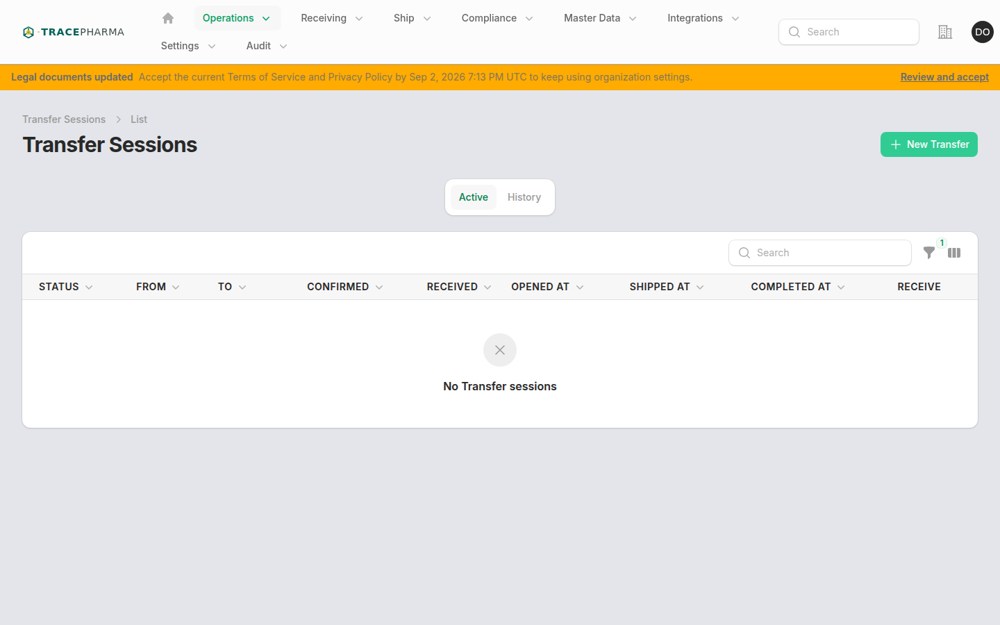
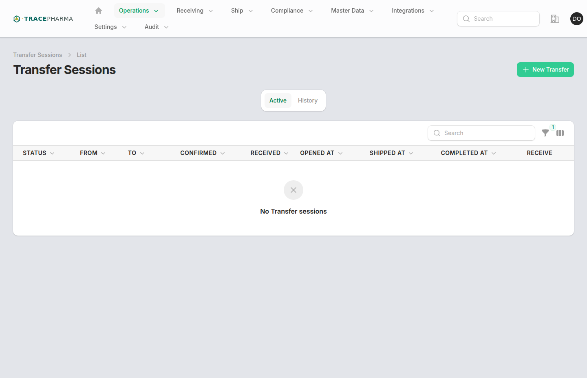

# Transferring

- **Slug / URL:** `/transferring-sessions`, `/transferring-sessions/{id}`
- **Filament:** `App\Filament\App\Resources\TransferringSessions\TransferringSessionResource`
- **Who:** `supportsTransferring()` and `NavShip`; hidden from pharmacy simplified nav
- **Produces:** ship leg: `shipping` + `in_transit`; receive leg: `receiving` + `in_progress`

## When to use

Move on-hand inventory between tenant sites without a trading-partner outbound integration. Complete ship at origin, then receive at destination (may share one EPCIS document).

## Prerequisites

- Both sites accessible to user.
- EPCs on hand at ship-from site; not on open outbound ship or another transfer.
- Destination site configured for transfer receive.

## Steps (with screenshots)

1. Open **Transfer** (`/transferring-sessions`) from Operations nav.

2. Create transfer session — select ship-from and ship-to sites.
3. Confirm scans at origin; **complete ship** → `GenerateTransferringEpcisEvents` (`shipping` / `in_transit`).
4. At destination, open the paired receive flow and **complete receive** → `GenerateTransferringReceiveEpcisEvents` (`receiving` / `in_progress`).

## Authored EPCIS checklist

- [ ] Ship ObjectEvents: `bizStep` `shipping`, disposition `in_transit`
- [ ] Receive ObjectEvents: `bizStep` `receiving`, disposition `in_progress`
- [ ] No custom `transferring` biz_step — reuses trading-partner CBV steps
- [ ] Site GLNs on readPoint / bizLocation per leg
- [ ] Custody moves to in-transit then destination on-hand

## Related pages

- [receiving.md](receiving.md) — transfer receive uses receive semantics
- [outbound-shipping.md](outbound-shipping.md) — partner-facing ship (different profile)
- [asset-tracking.md](asset-tracking.md) — verify in-transit custody

## Notes / known quirks

- Transfers do **not** invent a `transferring` biz_step; see [cbv-biz-steps.md](cbv-biz-steps.md).
- Mobile floor view: `MobileViewTransferringSession`.
- Operations Hub may route shippable scans to open transfer sessions.
