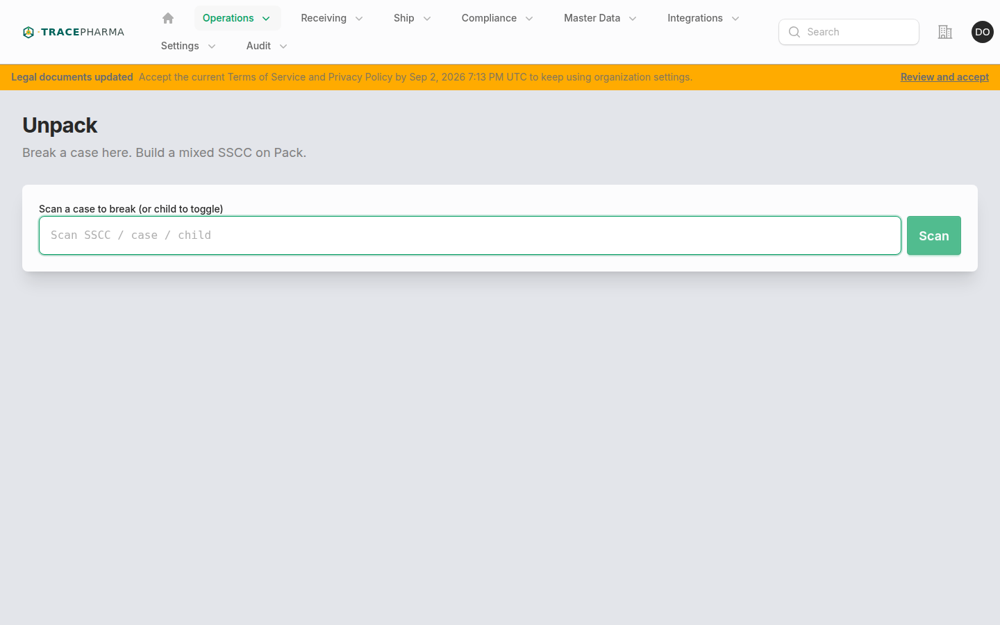
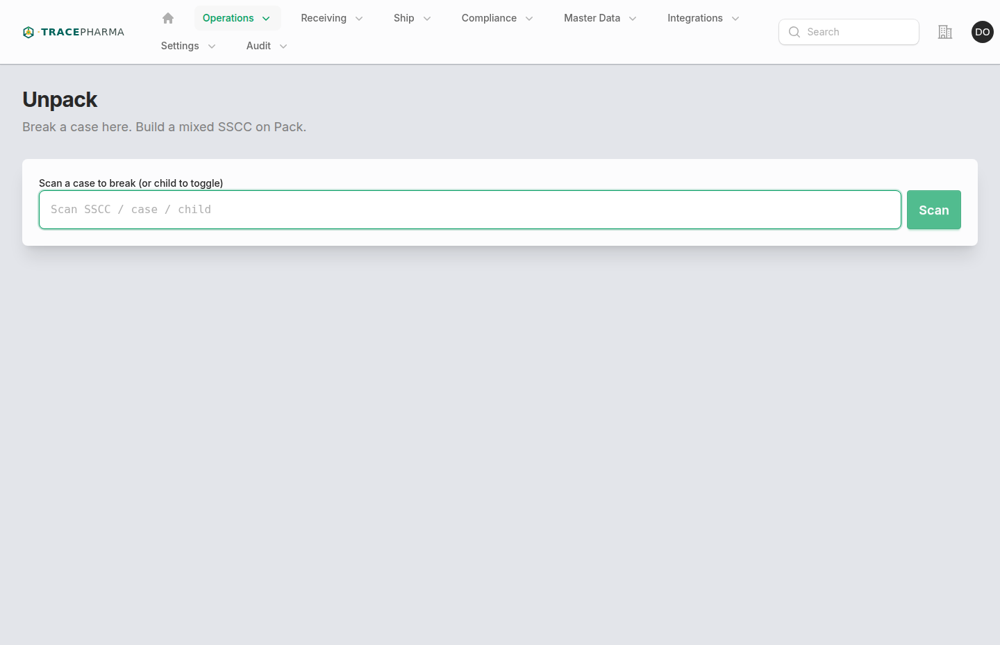

# Unpack

- **Slug / URL:** `/unpack-workstation`
- **Filament:** `App\Filament\App\Pages\UnpackWorkstation`
- **Who:** `supportsUnpacking()` or receive-time unpack policy; `NavShip`; site chooser required
- **Produces:** `unpacking` + `in_progress` (AggregationEvent DELETE)

## When to use

Break a case or mixed SSCC to loose units or child logistics IDs before repacking on Pack or shipping singles. Subheading: *Break a case here. Build a mixed SSCC on Pack.*

## Prerequisites

- Parent SSCC/SGTIN on hand at selected site with open aggregation children.
- EPC passes custody and receiving gates (not on open ship/transfer session, etc.).
- Child locks acquired before confirm (`AcquirePackChildLocks`).

## Steps (with screenshots)

1. Open **Unpack** from Operations nav or Operations Hub directory link.

2. Scan parent SSCC — children load in the open-children list.
3. Select children to remove (or all), then confirm unpack.
4. `UnpackReceivingHierarchy` authors AggregationEvent DELETE with unpacking biz step.

## Authored EPCIS checklist

- [ ] AggregationEvent **DELETE** for parent → selected children
- [ ] `bizStep`: `urn:epcglobal:cbv:bizstep:unpacking`
- [ ] `disposition`: `urn:epcglobal:cbv:disp:in_progress`
- [ ] Parent and child EPC URNs in event
- [ ] Custody updated for unpacked children

## Related pages

- [pack.md](pack.md) — aggregate loose units into new SSCC
- [break-pack.md](break-pack.md) — unpack + re-pack in one flow
- [receiving.md](receiving.md) — receive may trigger inline unpack branch

## Notes / known quirks

- Unpack is hidden from pharmacy simplified nav when wholesale operations are suppressed.
- Regulatory compliance wrapper may add affirmations on confirm action.
