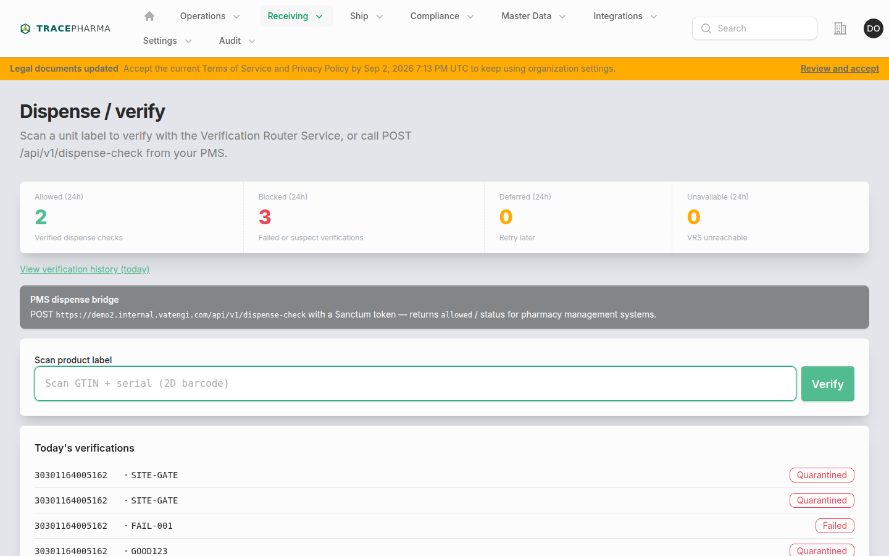
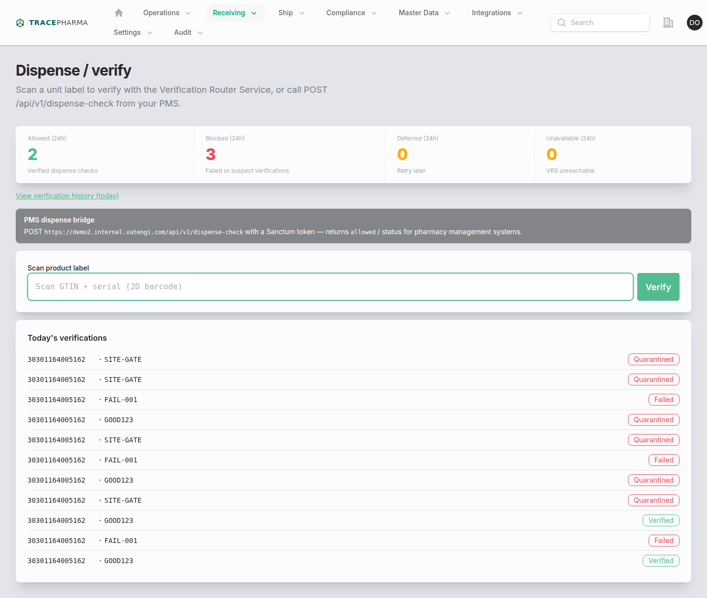

# Dispense / verify

- **Slug / URL:** `/verify-product`
- **Filament:** `App\Filament\App\Pages\VerifyProduct`
- **Who:** `supportsVrs()` and `NavVerify`
- **Produces:** — (VRS verification record only; no authored outbound EPCIS)

## When to use

Scan a unit at dispense or returns intake to verify with the Verification Router Service (VRS). Supports deep links: `?barcode=…` or `?gtin=…&serial=…`. API equivalent: `POST /api/v1/dispense-check`.

## Prerequisites

- VRS enabled for tenant; lookup credentials configured.
- Optional site context for scorecard metrics.
- Barcode must parse to GTIN + serial (GS1 element string).

## Steps (with screenshots)

1. Open **Dispense / verify** from Receiving nav, or **Verify product** from Operations Hub Directories.

2. Scan or paste barcode; verification runs automatically on mount when query params present.
3. Review result tone (verified / suspect / unknown) and scorecard when enabled.
4. Follow links to Verification or Exception resources when created.

## Authored EPCIS checklist

Not applicable — this page creates **Verification** records (and optional **Exception** cases), not EPCIS ObjectEvents.

- [ ] VRS request/response stored on `Verification` model
- [ ] Exception opened when policy requires investigation
- [ ] No `biz_step` / `disposition` authored here

## Related pages

- [saleable-return.md](saleable-return.md) — requires VRS pass before returning EPCIS
- [pharmacy-outbound.md](pharmacy-outbound.md) — ship after verify at pharmacy
- [asset-tracking.md](asset-tracking.md) — trace serial history

## Notes / known quirks

- Navigation label **Dispense / verify** differs from slug `verify-product`.
- Operations Hub Directories card is labeled **Verify product** (same `/verify-product` page).
- Fail-closed when VRS misconfigured (`VrsConfigurationException`).
- Scorecard visibility controlled by tenant/user policy on page.
